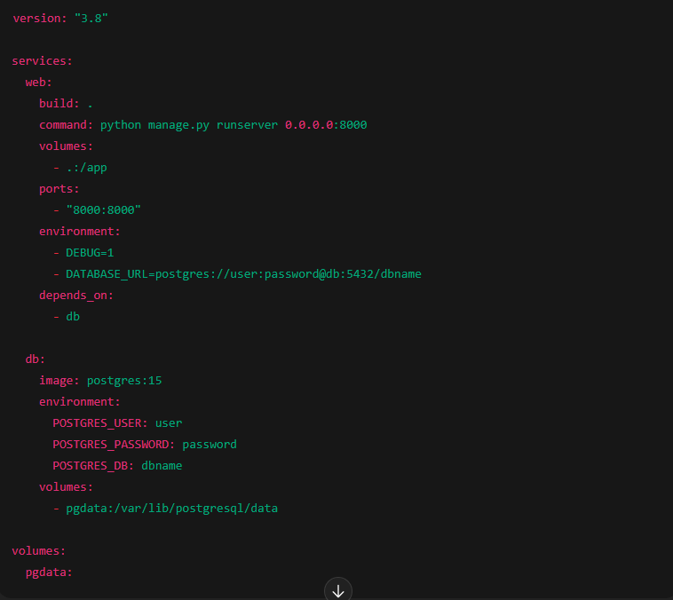

# Parte do backend

## Projeto Perícia Grafotécnica - Backend

## Sumário

- [Descrição Geral](#descrição-geral)
- [Tecnologias Utilizadas](#tecnologias-utilizadas)
- [Estrutura do Projeto](#estrutura-do-projeto)
- [Endpoints Principais](#endpoints-principais)
- [Autenticação e Permissões](#autenticação-e-permissões)
- [Módulos e Funcionalidades](#módulos-e-funcionalidades)
  - [Casos (Cases)](#casos-cases)
  - [Análises (Analyses)](#análises-analyses)
  - [Quesitos (Inquiries)](#quesitos-inquiries)
  - [Comparações (Comparisons)](#comparações-comparisons)
  - [Documentos e Versões](#documentos-e-versões)
  - [Tipos de Falsificação (Forgery Types)](#tipos-de-falsificação-forgery-types)
  - [Comentários](#comentários)
- [Geração de Relatório PDF](#geração-de-relatório-pdf)
- [Assinatura Digital do PDF](#assinatura-digital-do-pdf)
- [Melhorias e Boas Práticas](#melhorias-e-boas-práticas)
- [Como Contribuir](#como-contribuir)
- [Licença](#licença)

---

## Descrição Geral

Este backend foi desenvolvido para suportar um sistema de perícia grafotécnica, que auxilia peritos na análise técnica de assinaturas em documentos. O sistema gerencia casos, análises, quesitos (perguntas formuladas pelo Assistente Técnico Jurídico), comparações entre assinaturas, controle de versões dos documentos, e permite a geração de relatórios técnicos em PDF, com possibilidade de assinatura digital.

---

## Tecnologias Utilizadas

- Python 3.x  
- Django 4.x  
- Django REST Framework (DRF)  
- ReportLab (para geração de PDFs)  
- OpenAI API (para análises automáticas de assinaturas)  
- Banco de dados: SQLite/PostgreSQL  
- Docker  

---

## Estrutura do Projeto

- /project_root
- /cases
- /analysis
- /users
- /static
- manage.py
- requirements.txt
- README.md

- `analysis/`: Contém modelos, serializers, views e rotas para análises, comparações, quesitos e relatórios.  
- `cases/`: Gerencia casos jurídicos e documentos relacionados.  
- `users/`: Autenticação e gerenciamento de usuários.  
- `static/`: Arquivos estáticos, como logos para relatórios.  

---

## Endpoints Principais

### Casos

- `GET /cases/` — Listar casos do usuário autenticado  
- `POST /cases/` — Criar novo caso  
- `GET /cases/{id}/` — Detalhes de um caso  

### Análises

- `POST /cases/{case_id}/analyses/create/` — Criar análise para um caso  
- `GET /cases/{case_id}/analyses/` — Listar análises de um caso  
- `GET /analyses/` — Listagem geral de análises (via router)  

### Quesitos

- `GET /cases/{case_id}/quesitos/` — Listar quesitos do caso  
- `PATCH /quesitos/{id}/` — Atualizar/responder quesito (restrito ao perito do caso)  
- `GET /quesitos/{id}/` — Detalhes do quesito  

### Comparações

- `GET /analyses/{analysis_id}/comparisons/` — Listar comparações da análise  
- `POST /analyses/{analysis_id}/comparisons/` — Criar comparação com cálculo de similaridade e análise automática via OpenAI  
- `GET /comparisons/{id}/detail_result/` — Resultado detalhado da comparação  

### Document Versions

- `GET /documents/{document_id}/versions/` — Listar versões de um documento  
- `POST /documents/{document_id}/versions/` — Criar nova versão  
- `GET /documents/versions/{version_id}/download/` — Download seguro da versão  

### Relatórios

- `GET /cases/{case_id}/report/` — Gera PDF com o laudo técnico do caso, com análises, quesitos e assinatura  

---

## Autenticação e Permissões

- Autenticação via Django REST Framework (tokens ou session)  
- Permissões customizadas para garantir acesso apenas a usuários autorizados:  
  - Somente o perito pode responder quesitos do seu caso  
  - Usuários só acessam dados relacionados aos seus casos  
  - Controle rigoroso em todas as views e serializers  

---

## Módulos e Funcionalidades

### Casos (Cases)

- Gerenciamento dos casos jurídicos e documentos relacionados  
- Associação direta com o usuário/perito responsável  

### Análises (Analyses)

- Registro das análises técnicas com observações, metodologia e conclusão  
- Associação com documentos originais e contestados  

### Quesitos (Inquiries)

- Perguntas formuladas pelo Assistente Técnico Jurídico (A.T.J)  
- O perito responde a cada quesito diretamente via API  
- Controle de permissões para garantir que apenas o perito responda  

### Comparações (Comparisons)

- Comparação entre padrões e documentos usando algoritmos de similaridade  
- Uso de OpenAI para análises automáticas e explicativas  
- Controle de versões para garantir rastreabilidade  

### Documentos e Versões

- Upload e controle de múltiplas versões dos documentos  
- Download seguro e controlado  

### Tipos de Falsificação (Forgery Types)

- Catálogo para classificação de falsificações  
- Controle de acesso e edição por usuário ou staff  

### Comentários

- Sistema de comentários aninhados para discussões e revisões  
- Controle de autoria e permissões específicas  

---

## Geração de Relatório PDF

- Geração dinâmica de laudos técnicos em PDF com ReportLab  
- Inclusão de marca d’água, cabeçalho, rodapé e imagens comparativas  
- Inclusão dos quesitos e respostas do perito  
- Espaço reservado para assinatura do perito  

---

## Assinatura Digital do PDF

- Integração com certificado digital PFX para assinatura dos PDFs  
- Suporte a Timestamp Authority (TSA) para validação temporal  
- Em caso de erro, o PDF é gerado sem assinatura para garantir entrega  

---

## Melhorias e Boas Práticas

- Validações completas em serializers para integridade dos dados  
- Logging e tratamento de exceções para facilitar manutenção  
- Organização do código em módulos coerentes  
- Uso de ViewSets e Routers para facilitar escalabilidade da API  
- Documentação via OpenAPI/Swagger (drf-yasg)  

---

## Uso de Docker

- Este projeto oferece suporte para execução em ambiente Docker, facilitando a configuração, isolamento e deploy do backend de forma consistente, independente do sistema operacional local.

  ### Pré-requisitos
  - Docker instalado: https://docs.docker.com/get-docker/
  - Docker Compose instalado: https://docs.docker.com/compose/install/

## Estrutura do ambiente Docker

- `Dockerfile` — Define a imagem base Python com as dependências do projeto instaladas
- `docker-compose.yml` — Configura os serviços (web, banco de dados, etc.) e volumes para persistência
- Diretórios montados como volumes para facilitar desenvolvimento local

## Comandos básicos
1º - Build da imagem e inicialização dos containers
```bash
docker-compose up --build -d
```
Este comando constrói a imagem do backend (instalando dependências e configurando o ambiente) e inicia o container em segundo plano.

2º - Verificar logs do serviço web
```bash
docker-compose logs -f web
```
Exibe os logs em tempo real, útil para debug e acompanhamento.

3º - Acessar o terminal do container web
```bash
docker-compose exec web s
```
Permite acessar o terminal dentro do container para executar comandos Django, como manage.py.

4º - Executar comandos Django
Exemplo para rodar makemigrations:
```bash
docker-compose exec web python manage.py makemigrate
```

Exemplo para rodar migrations:
```bash
docker-compose exec web python manage.py migrate
```
Exemplo para criar superusuário:
```bash
docker-compose exec web python manage.py createsuperuser
```
5º - Parar e remover containers
```bash
docker-compose down
```
---
# Dicas importantes
- Banco de dados: Certifique-se que o serviço do banco de dados esteja ativo no docker-compose.yml e que as variáveis de ambiente estejam configuradas corretamente no `.env` ou direto no `docker-compose.yml`
- Dependências: Caso adicione novas dependências Python, reconstrua a imagem com `docker-compose build --no-cache web` para garantir atualização correta.
- Volumes: Para desenvolvimento, mantenha volumes montados para facilitar edição do código sem rebuilds constantes.
- Debug: Caso encontre erros de importação ou módulos faltando, confira se o container foi reconstruído e que o ambiente virtual dentro do container está correto.
- Portas: O backend estará disponível em `http://localhost:8000` por padrão, conforme mapeado no `docker-compose.yml`.

## Exemplo mínimo de docker-compose.yml (simplificado)


## Como Contribuir

1. Faça um fork deste repositório  
2. Crie uma branch para sua feature (`git checkout -b feature/nome-da-feature`)  
3. Faça commits claros e significativos  
4. Envie um Pull Request para avaliação  

---

## Licença

Este projeto está licenciado sob a Licença MIT. Consulte o arquivo LICENSE para mais detalhes.

---

